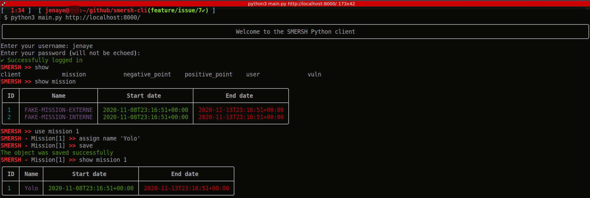

# How to install

>requirement : python 3.8


`pip3 install -r requirements.txt`

# How to use 

`python3 main.py http://localhost:8000/` 

# Smersh interactive shell



## Commands


### Show 


```
SMERSH >> show mission 
╭────┬──────────────────────┬───────────────────────────┬───────────────────────────╮
│ ID │         Name         │        Start date         │         End date          │
├────┼──────────────────────┼───────────────────────────┼───────────────────────────┤
│ 1  │ FAKE-MISSION-EXTERNE │ 2020-11-08T23:16:51+00:00 │ 2020-11-13T23:16:51+00:00 │
│ 2  │ FAKE-MISSION-INTERNE │ 2020-11-08T23:16:51+00:00 │ 2020-11-13T23:16:51+00:00 │
╰────┴──────────────────────┴───────────────────────────┴───────────────────────────╯

SMERSH >> show mission 1
╭────┬──────┬───────────────────────────┬───────────────────────────╮
│ ID │ Name │        Start date         │         End date          │
├────┼──────┼───────────────────────────┼───────────────────────────┤
│ 1  │ Yolo │ 2020-11-08T23:16:51+00:00 │ 2020-11-13T23:16:51+00:00 │
╰────┴──────┴───────────────────────────┴───────────────────────────╯
``` 


### Add

>use `<entity>`  then : 

> `assign <field> '<value>'`

> Finaly `save` ( to make post request )

``` 
SMERSH - Mission[1] >> use user 
SMERSH - User[NEW] >> assign name 'toto'
SMERSH - User[NEW] >> assign username 'toto'
SMERSH - User[NEW] >> assign password 'toto'
SMERSH - User[NEW] >> assign roles add ROLE_ADMIN
SMERSH - User[NEW] >> assign roles add ROLE_USER
SMERSH - User[NEW] >> assign enabled true
SMERSH - User[NEW] >> save
The object was saved successfully
SMERSH - User[4] >> show
╭────┬──────┬─────────┬───────────────────╮
│ ID │ Name │ Enabled │ Assigned missions │
├────┼──────┼─────────┼───────────────────┤
│ 4  │ toto │   Yes   │       None        │
╰────┴──────┴─────────┴───────────────────╯

``` 


### Edit 
>use `<entity> <id>`  then  : 

> ` assign <field> '<value>'`

> Finaly `save` ( to make put request )


``` 
SMERSH >> use mission 1
SMERSH - Mission[1] >> assign name 'Yolo'
SMERSH - Mission[1] >> save
The object was saved successfully
SMERSH - Mission[1] >> show mission 1
╭────┬──────┬───────────────────────────┬───────────────────────────╮
│ ID │ Name │        Start date         │         End date          │
├────┼──────┼───────────────────────────┼───────────────────────────┤
│ 1  │ Yolo │ 2020-11-08T23:16:51+00:00 │ 2020-11-13T23:16:51+00:00 │
╰────┴──────┴───────────────────────────┴───────────────────────────╯

``` 


